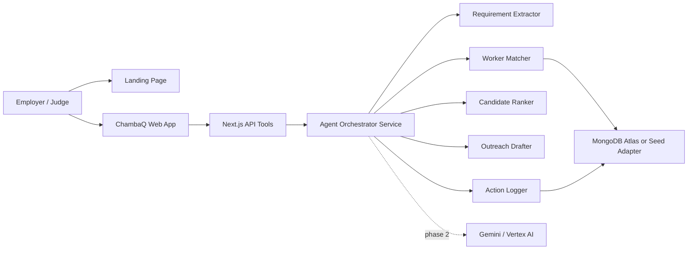

# ChambaQ Technical Specs

Estado: Draft técnico para Cursor  
Objetivo: construir plataforma web + landing + demo agentic MVP

## 1. Stack recomendado

### Frontend y web app

- Next.js 15 con App Router.
- TypeScript.
- Tailwind CSS.
- shadcn/ui para componentes base.
- lucide-react para iconos.
- Recharts opcional para visualización de scoring.

### Backend/API

- Next.js Route Handlers para MVP.
- Servicios internos en `src/lib/`.
- Zod para validación de payloads.
- MongoDB Node.js driver o Mongoose, preferencia: driver oficial para mantener bajo acoplamiento.

### IA/agentes

- Fase 1: flujo determinista local sin LLM para garantizar demo.
- Fase 2: Gemini API o Vertex AI para `extract_job_requirements` y resumen natural.
- Fase 3: Google Cloud Agent Builder / ADK si el tiempo permite orquestación más formal.

### Datos

- Fuente local inicial: `dataset/seeds/seed_data.json`.
- Fuente final: MongoDB Atlas.
- Colecciones: `workers`, `employers`, `jobs`, `certifications`, `reviews`, `outreach_logs`.

### Diseño

- Google Stitch para generar pantallas, flujos y diseño visual.
- `STITCH_DESIGN_BRIEF.md` como prompt fuente.
- Exportar a código o usar `DESIGN.md`/capturas como referencia en Cursor.

### Deploy

- Vercel para demo web rápida.
- Cloud Run si se prioriza Google Cloud alignment.
- MongoDB Atlas para base remota.

## 2. Arquitectura objetivo



## 3. Carpetas propuestas

```text
src/
  app/
    page.tsx                         # Landing
    demo/page.tsx                    # Demo app
    api/agent/run/route.ts           # Ejecuta flujo completo
    api/jobs/route.ts                # Crea/lista jobs
    api/workers/search/route.ts      # Search workers
  components/
    landing/
    demo/
    ui/
  lib/
    agent/
      orchestrator.ts
      extract-job-requirements.ts
      search-workers.ts
      rank-candidates.ts
      explain-tradeoff.ts
      draft-outreach.ts
      action-log.ts
    data/
      seed-adapter.ts
      mongo-adapter.ts
      repositories.ts
    schemas/
      job.ts
      worker.ts
      outreach.ts
    config.ts
  styles/
```

## 4. Pantallas de la plataforma

### Landing pública `/`

Objetivo: explicar ChambaQ Agent y llevar a la demo.

Secciones:

- Hero: "ChambaQ Agent".
- Problema: contratación local informal y riesgosa.
- Solución: agente que toma acción.
- Flujo: extrae, busca, rankea, explica, redacta, registra.
- Partner tech: MongoDB + Gemini + Google Cloud.
- Roadmap: WhatsApp real, onboarding, certificaciones, pagos, blockchain futuro.
- CTA: abrir demo.

### Demo app `/demo`

Layout:

- Columna izquierda: request input y conversación.
- Centro: agent plan/action log.
- Derecha: shortlist de candidatos.
- Panel inferior o modal: outreach drafts.

Estados:

- Empty: ejemplo de prompt precargado.
- Running: pasos del agente animados.
- Results: shortlist con razones.
- Approval: botones "Preparar mensajes" y "Registrar outreach".
- Error/empty results: sugerencias para relajar criterios.

### Admin/Data view opcional `/data`

Solo si queda tiempo:

- Workers seed.
- Jobs creados.
- Outreach logs.

## 5. API contracts

### POST `/api/agent/run`

Input:

```json
{
  "message": "Necesito un plomero en Cancun para manana temprano...",
  "employerId": "employer_001",
  "mode": "seed"
}
```

Output:

```json
{
  "jobRequest": {
    "trade": "plomero",
    "trade_canonical": "plumbing",
    "city": "Cancun",
    "urgency": "next_day",
    "urgency_iso_date": "2026-05-25",
    "budget_mxn": 1800,
    "quality_priority": "high",
    "description": "Fuga en cocina de restaurante"
  },
  "job": {
    "_id": "job_demo_001",
    "status": "shortlisted"
  },
  "candidates": [],
  "ranked": [],
  "outreachDrafts": [],
  "actionLog": []
}
```

### POST `/api/workers/search`

Input:

```json
{
  "trade_canonical": "plumbing",
  "city": "Cancun",
  "availabilitySlot": "2026-05-25_morning",
  "budget_mxn": 1800
}
```

Output:

```json
{
  "candidates": [],
  "total": 3,
  "queryUsed": {
    "trade_canonical": "plumbing",
    "city": "Cancun",
    "verification_status": "verified"
  }
}
```

## 6. Ranking spec

Score 0-100.

| Factor | Peso |
|---|---:|
| Rating | 25 |
| Completed jobs | 15 |
| Availability fit | 20 |
| Price fit | 15 |
| Certifications | 15 |
| Commercial relevance / notes match | 10 |

Ajustes:

- `quality_priority = high`: subir rating/certificaciones/commercial relevance.
- `urgency = same_day|next_day`: subir availability.
- Presupuesto rígido: penalizar fuerte si `rate_min_mxn > budget_mxn`.

## 7. Agent tool functions

Implementar como funciones puras primero:

- `extractJobRequirements(message): JobRequest`
- `createJobRequest(jobRequest, employerId): Job`
- `searchWorkers(jobRequest): Worker[]`
- `rankCandidates(jobRequest, workers): RankedCandidate[]`
- `explainTradeoff(jobRequest, ranked): TradeoffSummary`
- `draftOutreachMessages(jobRequest, ranked): OutreachDraft[]`
- `logOutreach(jobId, drafts): OutreachLog[]`

Después envolverlas como API tools o MCP tools.

## 8. Variables de entorno

```bash
MONGODB_URI=
MONGODB_DB=chambaq_demo
GOOGLE_API_KEY=
GOOGLE_CLOUD_PROJECT=
GOOGLE_CLOUD_LOCATION=us-central1
DATA_MODE=seed
```

## 9. MCP/CLI strategy

### CLI mínima

- `npm run dev`: servidor local.
- `npm run seed`: carga seed en MongoDB si existe `MONGODB_URI`.
- `npm run demo:test`: ejecuta flujo demo por CLI y valida output.
- `npm run lint`: lint.
- `npm run typecheck`: TypeScript.

### MCP recomendado

- MongoDB MCP: consultar y escribir colecciones reales.
- Stitch MCP/SDK: generar pantallas y exportar diseño cuando esté disponible en el entorno.
- GitHub/GitLab MCP opcional: issues, PR y CI.
- Arize/OpenInference opcional: tracing y evals después de tener runtime.

## 10. Definition of Done

- Landing y demo app compilan.
- El prompt demo produce 3 candidatos rankeados.
- Action log visible en UI.
- Outreach drafts visibles y no enviados.
- Seed local funciona sin servicios externos.
- MongoDB Atlas funciona cuando se configuran env vars.
- README tiene comandos para Cursor/local.
